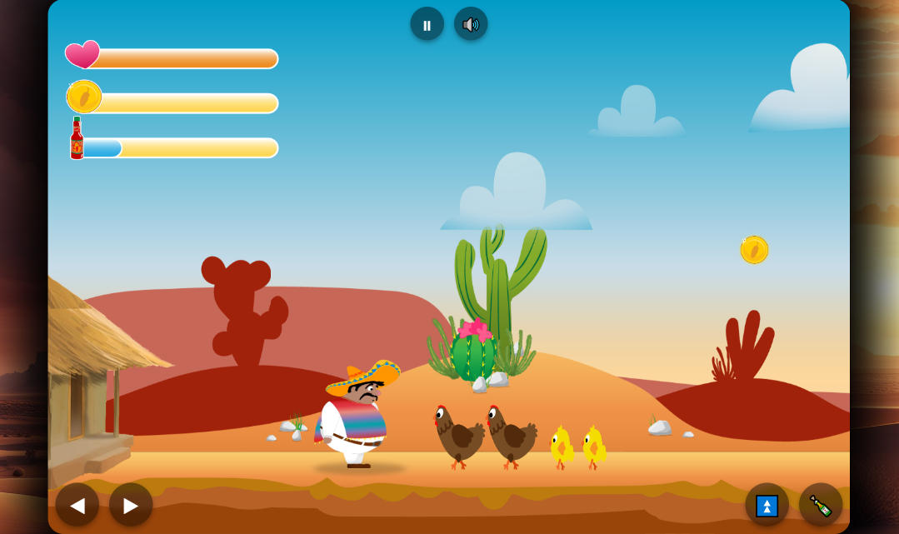

# El Pollo Loco

A 2D side-scrolling jump-and-run game built with **HTML, CSS and JavaScript**.

The player controls a character through different desert-themed levels, collects coins and bottles, fights enemies and faces an endboss.  
The project includes responsive controls, sound management, collision handling and frame-rate independent movement and animations.

---

## 🚀 Live Demo

👉 [Live Demo](https://zeroger001.github.io/el-pollo-loco/)

---

## 📸 Preview



---

## ✨ Features

- 2D jump-and-run gameplay
- Character movement, jumping and bottle throwing
- Enemy AI and endboss fight
- Collectible coins and bottles
- Health, coin and bottle status bars
- Mobile controls
- Pause and sound toggle
- Responsive canvas setup
- Frame-rate independent movement and animation

---

## 🛠 Technologies

- HTML5
- CSS3
- JavaScript (ES6)
- Canvas API
- Object-oriented programming
- Git
- GitHub Pages

---

## 📂 Project Structure

```text
el-pollo-loco
├── audio
├── css
├── img
├── javascript
│   ├── background
│   ├── character
│   ├── endGameConditions
│   ├── enemys
│   ├── game
│   ├── instructions
│   ├── keyboard
│   ├── levels
│   ├── objects
│   ├── sound-manager
│   ├── ui
│   └── world
├── index.html
```

---

## 👨‍💻 Author

Stefan Seegets

GitHub:  
https://github.com/Zeroger001
